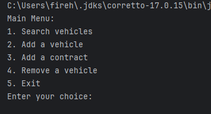
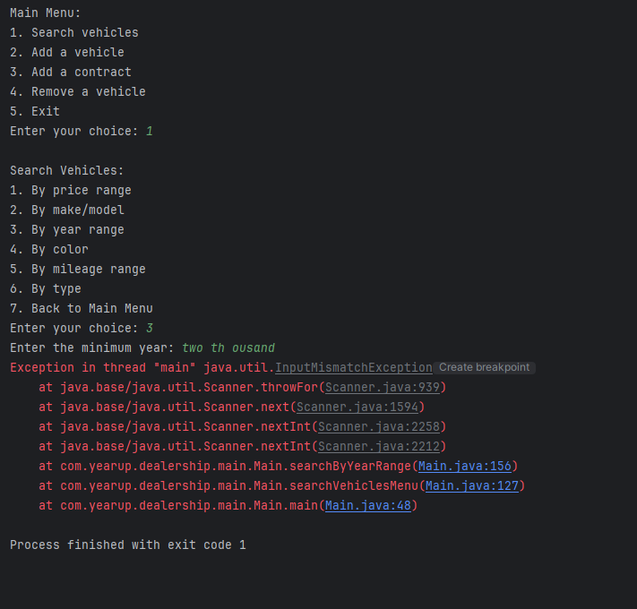

# JDBC Dealership Project

This is a Java application that connects to a MySQL database to manage a car dealership's inventory and contracts. The program allows users to search for vehicles, add or remove them, and create sales or lease contracts. All data is stored in a real database instead of text files.

## Project Structure

- `main` – Contains the main class that runs the program.
- `db` – Includes the DAO classes that handle database access.
- `models` – Java classes representing vehicles, contracts, and dealership info.

## Technologies

- Java 17
- MySQL 8.0
- JDBC (Java Database Connectivity)
- Maven
- IntelliJ IDEA

## Features

- Search for vehicles by:
    - Price range
    - Make and model
    - Year range
    - Color
    - Mileage
    - Vehicle type
- Add and remove vehicles
- Add sales or lease contracts
- All operations interact with the MySQL database

## Setup Instructions

1. Make sure MySQL is installed and running.
2. Create a database named `car_dealership`.
3. Set your MySQL username and password as program arguments:
4. Run the program using IntelliJ or the terminal.

## Interesting Code

Here's how the program creates a random VIN for each new vehicle:

## Home Screen

## Error for calc

## Author Info

Created by: Timothy Gomez  
Instructor: Raymond Maroun  
Pluralsight Java Workshop 8 – Database Integration
